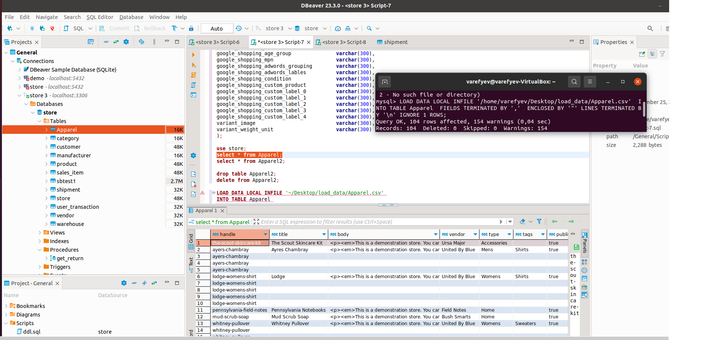
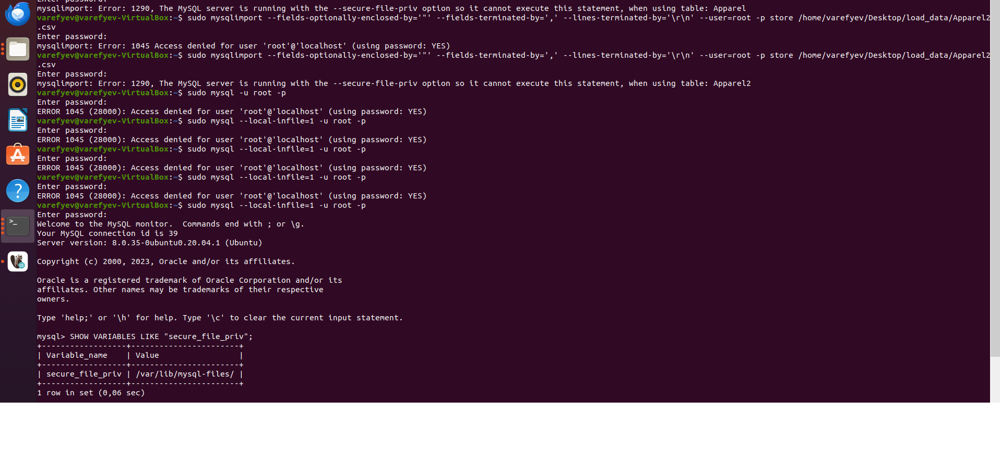
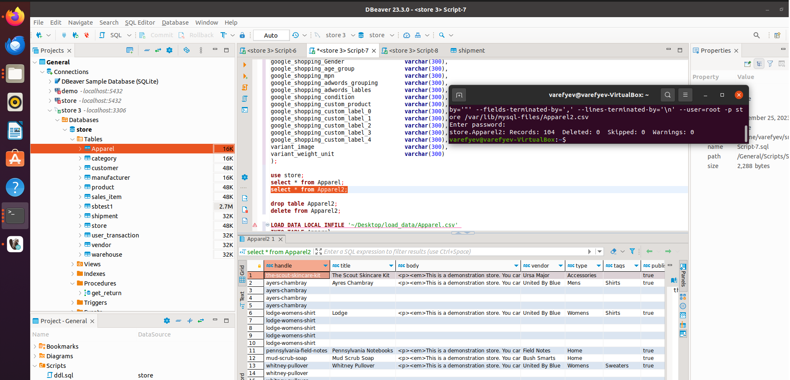

# HOMEWORK #11. Транзакции, MVCC, ACID.

### 1. Описать пример транзакции из своего проекта с изменением данных в нескольких таблицах. Реализовать в виде хранимой процедуры.

```sql
/* Процедура, принимающщяа два параметра:
---
p_product  - параметр, отвечающий за конкретный продукт.
p_shipment - параметр, отвечающий за конкретную поставку.
---
Ситуация: в магазин поступила поставка с мясными продуктами, партия оказалась бракованной. Требуется выполнить возврат партии обратно поставщику.
*/
CREATE PROCEDURE get_return(
    in p_product  integer(25), 
    in p_shipment integer(25)
)
BEGIN
-- удалим "бракованную" партию из таблицы:
DELETE from product
where id = p_product;

-- отметим партию индикатором, который обозначает то, что партию вернули обратно поставщику.
UPDATE shipment
set is_returned = 1
where id = p_shipment;
END;

-- вызов процедуры: 
call get_return(5, 1115);
```

### 2.1. Загрузить данные из приложенных в материалах csv. Реализовать следующими путями:
```sql
/* В глобальных настройках пропишем:
чтобы была возможность заливать данные с csv --> table
*/
SET GLOBAL local_infile=1;

-- создание таблицы:
CREATE TABLE `Apparel` (
`handle` varchar(30) NOT NULL,
`title` varchar(25) DEFAULT NULL,
`body` text,
`vendor` varchar(30) DEFAULT NULL,
`type` varchar(15) DEFAULT NULL,
`tags` varchar(15) DEFAULT NULL,
`published` varchar(10) DEFAULT NULL,
`option1_name` varchar(10) DEFAULT NULL,
`option1_value` varchar(25) DEFAULT NULL,
`option2_name` varchar(10) DEFAULT NULL,
`option2_value` varchar(5) DEFAULT NULL,
`option3_name` varchar(10) DEFAULT NULL,
`option3_value` varchar(10) DEFAULT NULL,
`variant_sku` varchar(15) DEFAULT NULL,
`variant_grams` int DEFAULT NULL,
`variant_inventory_tracker` varchar(10) DEFAULT NULL,
`variant_inventory_qty` int DEFAULT NULL,
`variant_inventory_policy` varchar(15) DEFAULT NULL,
`variant_fulfillment_service` varchar(6) DEFAULT NULL,
`variant_price` decimal(19,2) DEFAULT NULL,
`variant_compare_at_price` decimal(19,2) DEFAULT NULL,
`variant_requires_shipping` varchar(5) DEFAULT NULL,
`variant_taxable` varchar(5) DEFAULT NULL,
`variant_barcode` varchar(50) DEFAULT NULL,
`image_src` varchar(300) DEFAULT NULL,
`image_alt_text` varchar(50) DEFAULT NULL,
`gift_card` varchar(5) DEFAULT NULL,
`seo_title` varchar(10) DEFAULT NULL,
`seo_description` varchar(300) DEFAULT NULL,
`google_shopping_google_product_category` text,
`google_shopping_Gender` text,
`google_shopping_age_group` text,
`google_shopping_mpn` text,
`google_shopping_adwords_grouping` text,
`google_shopping_adwords_lables` text,
`google_shopping_condition` text,
`google_shopping_custom_product` text,
`google_shopping_custom_label_0` text,
`google_shopping_custom_label_1` text,
`google_shopping_custom_label_2` text,
`google_shopping_custom_label_3` text,
`google_shopping_custom_label_4` text,
`variant_image` varchar(200) DEFAULT NULL,
`variant_weight_unit` varchar(5) DEFAULT NULL
) ENGINE=InnoDB DEFAULT CHARSET=utf8mb4 COLLATE=utf8mb4_0900_ai_ci;
```
> Создадим папку, добавим в нее файл csv из репозитория. Дадим все привилегии на эту папку и файл внутри нее. 

```sql
LOAD DATA LOCAL INFILE 'home/varefyev/Desktop/load_data/Apparel.csv' 
INTO TABLE Apparel 
FIELDS TERMINATED BY ',' 
ENCLOSED BY '"'
LINES TERMINATED BY '\n'
IGNORE 1 ROWS;
```
> Результат работы:



### 2.2. Mysqlimport.

```sql
create table Apparel2(
handle varchar(300) not null,
title varchar(250),
body text,
vendor varchar(300),
type varchar(150),
tags varchar(150),
published varchar(100),
option1_name varchar(500),
option1_value varchar(500),
option2_name varchar(500),
option2_value varchar(500),
option3_name varchar(500),
option3_value varchar(500),
variant_sku varchar(500),
variant_grams varchar(300),
variant_inventory_tracker varchar(100),
variant_inventory_qty varchar(300),
variant_inventory_policy varchar(150),
variant_fulfillment_service varchar(60),
variant_price varchar(100),
variant_compare_at_price varchar(100),
variant_requires_shipping varchar(500),
variant_taxable varchar(500),
variant_barcode varchar(500),
image_src varchar(300),
image_alt_text varchar(150),
gift_card varchar(500),
seo_title varchar(100),
seo_description varchar(300),
google_shopping_google_product_category varchar(300),
google_shopping_Gender varchar(300),
google_shopping_age_group varchar(300),
google_shopping_mpn varchar(300),
google_shopping_adwords_grouping varchar(300),
google_shopping_adwords_lables varchar(300),
google_shopping_condition varchar(300),
google_shopping_custom_product varchar(300),
google_shopping_custom_label_0 varchar(300),
google_shopping_custom_label_1 varchar(300),
google_shopping_custom_label_2 varchar(300),
google_shopping_custom_label_3 varchar(300),
google_shopping_custom_label_4 varchar(300),
variant_image varchar(300),
variant_weight_unit varchar(300)

/* 
Этот способ чуть сложнее, чем прошлый:
Не получится выгрузить из csv --> table, т.к. получим ошибку с тем, что не хватает привилегий с отсылкой на secure_file_priv.
*/
SELECT @@secure_file_priv;
);
```
> В верхней части скрина - описание ошибки, в нижней - путь, из выборки выше, куда требуется положить файл csv.



>  Ниже приведена команда, которая перекачивает данные из csv --> table (имя таблицы = название файла).

```bash
sudo mysqlimport --fields-optionally-enclosed-by='"' --fields-terminated-by=',' --lines-terminated-by='\n' --user=root -p store /var/lib/mysql-files/Apparel2.csv
```
> Результат работы:

