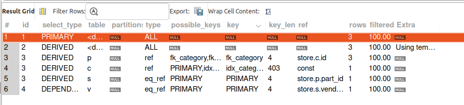
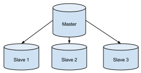

# HOMEWORK #17. Репликация.

### Задача:
-- ------------------------------------------
   Сформировать документ в котором описываем:
-- ------------------------------------------
* Прогноз по возможному росту базы;
* Рост данных;
* Рост количества пользователей;
* Всплески одновременных соединений;
* Описываем возможные угрозы и методы защиты от них;
* Предлагаем стратегии бэкапа;
* Репликации;
* Кластеризации.

> Задача будет представлена в 1-ом [грубом] приближении.

*Схема БД:* (дорабатывается)



``` text
-- --------------------------------------------------------------------------------------------------------------------------------
1. Прогноз по возможному росту базы.
-- --------------------------------------------------------------------------------------------------------------------------------
[Потребители]:

-------------------------------
| table <<user_transaction>>: |
===============================================================================================
В БД может сформироваться ~ 250-300 постоянных покупателей (ФЛ и ЮЛ) в день. 
В среднем, один покупатель совершает 4 транзакции в неделю, т.о.
в месяц покупатель совершает 16 транзакций, => 250-300 покупателей (4000 - 4800) новых запсисей.
===============================================================================================

-------------------------
| table <<sales_item>>: |
===============================================================================================
В рамках одной транзакции может быть в среднем до 8 наименований, т.о. (32000-38400) запсией.
===============================================================================================

[Снабжение]:

----------------------
| table <<product>>: |
===============================================================================================
В магазине ассортимент товаров придерживается определенного количества,
но периодически добавляется незначительное количество новых позиций.
В среднем, БД имеет 300 позиций товаров. Прирост незначительный, от 5-10 товаров в месяц.
===============================================================================================

-----------------------
| table <<category>>: |
===============================================================================================
В таблице не наблюдается значительного роста данных,
т.к. эта таблица служит как справочник, который очень редко обновляется.
===============================================================================================

--------------------
| table <<store>>: |
===============================================================================================
Таблица служит справочником и идентификатором магазина,
в котором совершалась покупка (прирост данных незначительный).
===============================================================================================

------------------------
| table <<warehouse>>: |
===============================================================================================
Таблица поддвержена динамике на постоянной основе,
т.к. магазины постоянно нуждаются в снабжении тем или иным продуктом.
На складе всегда должна быть в наличии продукция.  (???)
===============================================================================================

[Поставка]:

---------------------------
| table <<manufacturer>>: |
===============================================================================================
Таблица - справочник производителей, рост данных незначительный.
===============================================================================================

---------------------
| table <<vendor>>: |
===============================================================================================
Таблица - справочник поставщиков, рост данных незначительный.
===============================================================================================

-----------------------
| table <<shipment>>: |
===============================================================================================
Таблица - поддвержена динамике на постоянной основе, т.е. поставки формируются систематически,
в зависимости от того как быстро заканчиваются на складе тот или иной продукт.
===============================================================================================


-- --------------------------------------------------------------------------------------------------------------------------------
2. Рост данных.
-- --------------------------------------------------------------------------------------------------------------------------------
> Данные растут на постоянной основе: в день ~ 1443 записи, в месяц ~ 43310 записи.
-- --------------------------------------------------------------------------------------------------------------------------------


-- --------------------------------------------------------------------------------------------------------------------------------
3. Рост количества пользователей.
-- --------------------------------------------------------------------------------------------------------------------------------
Число покупателей имеет положительную тенденцую роста, но со временем упрется в потолок,
т.е. магазин наработает определенное количество постоянных покупателей, в дальнейшем прирост будет незначительным.
-- --------------------------------------------------------------------------------------------------------------------------------


-- --------------------------------------------------------------------------------------------------------------------------------
4.  Всплески одновременных соединений.
-- --------------------------------------------------------------------------------------------------------------------------------
Бывают моменты, когда на базу приходится большая нагрузка в определенный момент времени. 
Например, в какой-то день распродажа товаров какой-то конкретной категории, в связи с этим увеличвается нагрузка 
на запись новый строк в базу. Требуется контролировать нагрузку на RAM, поддерживать допустимый уровень, 
чтобы не возникли большие задержки при нагрузке.
-- --------------------------------------------------------------------------------------------------------------------------------


-- --------------------------------------------------------------------------------------------------------------------------------
5. Описываем возможные угрозы и методы защиты от них.
-- --------------------------------------------------------------------------------------------------------------------------------
* Ограничение привелегий, для каждого отдела и должностей свои полномочия.
* Введение учета на изменение и вставки данных.
* Бэкап в зашифрованном виде.
* Мониторинг места на диске, чтобы не возникло неприятных ситуаций.
* Настройка структуры паролей [чтобы фильтровать похожие].
-- --------------------------------------------------------------------------------------------------------------------------------


-- --------------------------------------------------------------------------------------------------------------------------------
6. Предложить стратегии бэкапа.
-- --------------------------------------------------------------------------------------------------------------------------------
Предлагается полный бэкап раз в неделю [воскресенье], 
с [понедельника по среду] предлагается инкрементальная копия, 
в [четверг] - дифференциальную, а с [пятницу-субботу] инкрементальную от дифференциальной. 
--> Бэкапы рекомендуется хранить на отдельном накопителе и в облачном хранилище.
-- --------------------------------------------------------------------------------------------------------------------------------

-- --------------------------------------------------------------------------------------------------------------------------------
7. Репликации.
-- --------------------------------------------------------------------------------------------------------------------------------
Архитектура будет состоять из одного master сервера и двух реплик для чтения и создания backup.
-- --------------------------------------------------------------------------------------------------------------------------------
```




