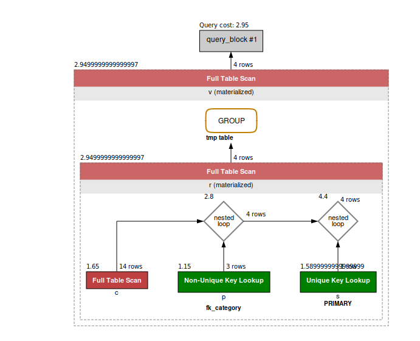
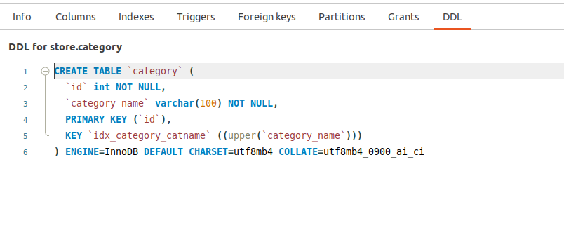
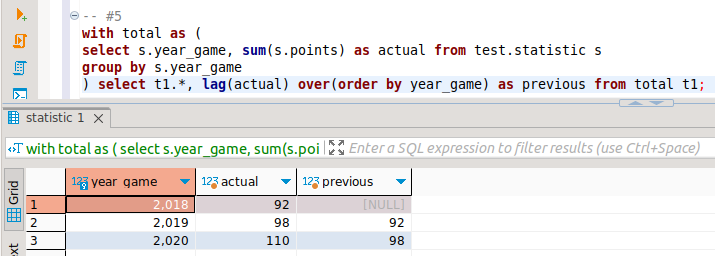
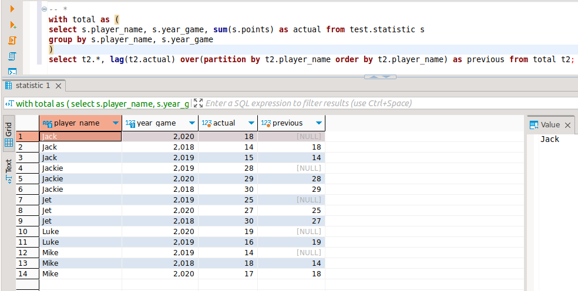

# HOMEWORK #5. DML: агрегация и сортировка, CTE, аналитические функции.

### 1. Создайте таблицу и наполните ее данными.
>Выполнено : [✓]
### 2. Заполнить данными.
>Выполнено : [✓]
### 3. Написать запрос суммы очков с группировкой и сортировкой по годам.
```sql
select year_game, sum(points) from test.statistic s
group by year_game
order by year_game;
```
> Результат работы:


### 4. Написать cte показывающее тоже самое.
```sql
with total as (
select year_game, sum(points) from test.statistic s
group by year_game
order by year_game;
) select * from total;
```
> Результат работы:


### 5. Используя функцию LAG вывести кол-во очков по всем игрокам за текущий год и за предыдущий.
```sql
with total as (
select s.year_game, sum(s.points) as actual from test.statistic s
group by s.year_game
) select t1.*, 
lag(actual) over(order by year_game) as previous from total t1;
-- (*) бонус, для каждого игрока за каждый год:
with total as (
select s.player_name, s.year_game, sum(s.points) as actual from test.statistic s
group by s.player_name, s.year_game
)
select t2.*, lag(t2.actual) over(partition by t2.player_name order by t2.player_name) as previous from total t2;
```
> Результат работы:



