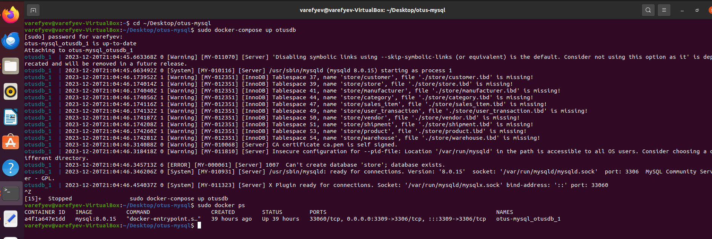
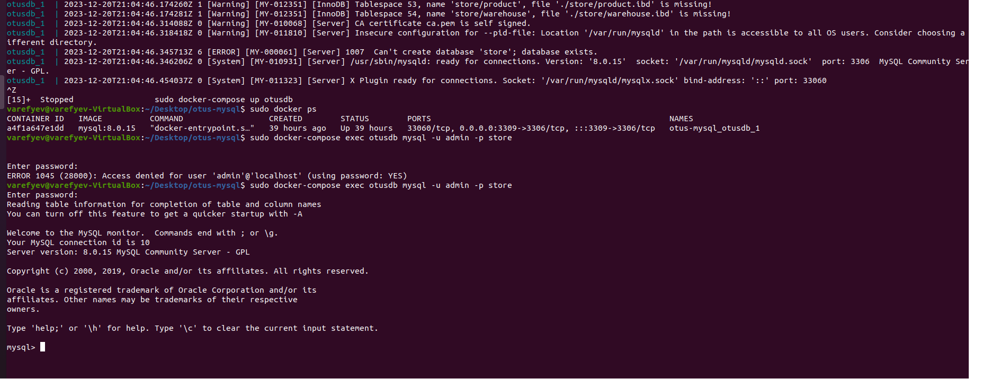
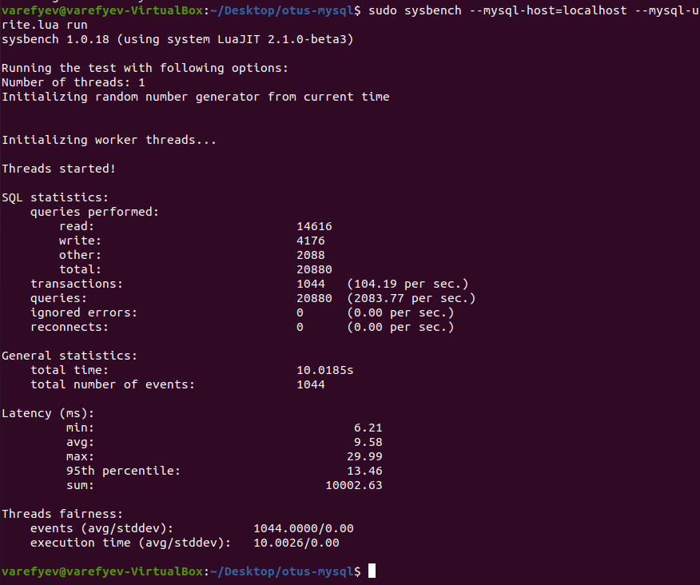

# HOMEWORK #8. Внутренняя архитектура СУБД MySQL.

### 1. Забрать стартовый репозиторий https://github.com/aeuge/otus-mysql-docker

>Выполнено : [✓]


### 2. Прописать sql скрипт для создания своей БД в init.sql.

>Выполнено : [✓]

```sql
-- create database
create database store;
 
-- create user
create user admin@'localhost' identified with mysql_native_password '24051995';
 
-- create privileges
grant all privileges on store.* to store@'localhost';
 
-- global settings: (***) => Дополнительное задание
set persist sort_buffer_size = 362144;
set persist innodb_buffer_pool = 234217728;
set global max_connections = 100;
 
USE store;
 
-- create table:
CREATE TABLE customer (
    id      integer      NOT NULL,
    first_name  varchar(100),
    last_name   varchar(100),
    second_name varchar(100),
    alias      varchar(300),
    phone       varchar(35)  NOT NULL,
    email       varchar(100) NOT NULL,
    city        varchar(100) NOT NULL,
    is_company  decimal(1,0)
);
 
 
CREATE TABLE sales_item (
    id     integer       NOT NULL,
    order_id     integer       NOT NULL,
    item_id     integer       NOT NULL,
    product_id  integer,
    quantity     integer       NOT NULL,
    list_price  double precision NOT NULL,
    discount integer
);
 
 
CREATE TABLE store (
    id     integer      NOT NULL,
    store_name varchar(150) NOT NULL,
    phone     varchar(35)  NOT NULL,
    email     varchar(100) NOT NULL,
    street     varchar(100) NOT NULL,
    city     varchar(100) NOT NULL
);
 
 
CREATE TABLE user_transaction (
    id      integer NOT NULL,
    customer_id  integer,
    order_status decimal(1,0),
    order_date   date,
    store_id      integer
);
 
 
CREATE TABLE manufacturer (
    id        integer     NOT NULL,
    producer_name varchar(150) NOT NULL
);
 
 
CREATE TABLE shipment (
    id        integer         NOT NULL,
    part_date        date            NOT NULL,
    part_quantity integer         NOT NULL,
    buy_price     double precision NOT NULL,
    prod_sum        double precision NOT NULL,
    vendor_id        integer
);
 
 
CREATE TABLE vendor (
    id      integer      NOT NULL,
    vendor_name varchar(150) NOT NULL,
    producer_id integer
);
 
 
CREATE TABLE category (
    id        integer     NOT NULL,
    category_name varchar(100) NOT NULL
);
 
 
CREATE TABLE product (
    id       integer         NOT NULL,
    product_name varchar(100)     NOT NULL,
    category_id  integer          NOT NULL,
    list_price   double precision NOT NULL,
    part_id      integer       NOT NULL
);
 
 
CREATE TABLE warehouse (
    id     integer NOT NULL,
    product_id integer NOT NULL,
    quantity   integer NOT NULL,
    city       varchar(100),
    address    varchar(100),
    arr_date   date NOT NULL,
    rec_date   date NOT NULL
);
 
-- PK, UNIQUE
 
ALTER TABLE customer
    ADD CONSTRAINT pk_customer PRIMARY KEY (id);
 
 
ALTER TABLE sales_item
    ADD CONSTRAINT pk_sales_item PRIMARY KEY (id);
 
 
ALTER TABLE store
    ADD CONSTRAINT pk_store PRIMARY KEY (id);
 
 
ALTER TABLE user_transaction
    ADD CONSTRAINT pk_transaction PRIMARY KEY (id);
 
 
ALTER TABLE customer
    ADD CONSTRAINT u_email UNIQUE (email);
 
 
ALTER TABLE sales_item
    ADD CONSTRAINT u_order_item_id UNIQUE (order_id, item_id);
 
 
ALTER TABLE customer
    ADD CONSTRAINT u_phone UNIQUE (phone);
 
 
ALTER TABLE store
    ADD CONSTRAINT u_storeemail UNIQUE (email);
 
ALTER TABLE store
    ADD CONSTRAINT u_storephone UNIQUE (phone);
 
ALTER TABLE manufacturer
    ADD CONSTRAINT pk_manufacturer PRIMARY KEY (id);
 
ALTER TABLE shipment
    ADD CONSTRAINT pk_shipment PRIMARY KEY (id);
 
ALTER TABLE vendor
    ADD CONSTRAINT pk_vendor PRIMARY KEY (id);
 
 
ALTER TABLE category
    ADD CONSTRAINT pk_category PRIMARY KEY (id);
 
ALTER TABLE product
    ADD CONSTRAINT pk_product PRIMARY KEY (id);
 
ALTER TABLE warehouse
    ADD CONSTRAINT pk_warehouse PRIMARY KEY (id);
    
-- FK
ALTER TABLE sales_item
    ADD CONSTRAINT fk_sales_item FOREIGN KEY (product_id) REFERENCES product(id);
 
ALTER TABLE user_transaction
    ADD CONSTRAINT fk_store FOREIGN KEY (store_id) REFERENCES store(id);
 
ALTER TABLE vendor
    ADD CONSTRAINT fk_manufacturer FOREIGN KEY (producer_id) REFERENCES manufacturer(id);
 
ALTER TABLE shipment
    ADD CONSTRAINT fk_vendor FOREIGN KEY (vendor_id) REFERENCES vendor(id);
 
ALTER TABLE product
    ADD CONSTRAINT fk_category FOREIGN KEY (category_id) REFERENCES category(id);
 
ALTER TABLE product
    ADD CONSTRAINT fk_shipment FOREIGN KEY (part_id) REFERENCES shipment(id);
 
ALTER TABLE warehouse
    ADD CONSTRAINT fk_warehouse FOREIGN KEY (product_id) REFERENCES product(id);
 
-- insert
 
INSERT INTO customer (id, first_name, last_name, second_name, alias, phone, email, city, is_company)
VALUES    
(1, 'Victor',    'Arephev',    'Nicolaevich',    null,    '+79608671275', 'xoyk@yandex.ru',    'Sochi', 0),
(2, 'Darja',    'Zorina',    null,    null,    '+79189096010',    'pupcik@mail.ru',    'Vilnuis',    0),    
(3, null,    null,    null,    'GreatSon',    '2645088',    'greatson@yahoo.com',    'Boston',    1),    
(4, null,    null,    null,    'Google',    '2456780',    'google@gmail.com',    'New-York',    1),    
(5, 'Nikolay',    'Belko',    'Victorovich',    null,    '+79186702013',    'kolyan@mail.ru',    'Sochi',    0),
(6, 'Nikolay',    'Bymagin',    'Victorovich',    null,    '+7189032014',    'kolyan1@mail.ru',    'Moscow',    0),    
(7, 'Nikolay',    'Zaripov',    'Victorovich',    null,    '+7189032015',    'kolyan2@mail.ru',    'Volgograd',    0),    
(8, 'Nikolay',    'Tyrapov',    'Victorovich',    null,    '+7189032016',    'kolyan3@mail.ru',    'Voronez',    0),    
(9, 'Nikolay',    'Turovski',    'Victorovich',    null,    '+7189032017',    'kolyan4@mail.ru',    'Krasnodar',    0),    
(10, 'Nikolay',    'Simonov',    'Victorovich',    null,    '+7189032018',    'kolyan5@mail.ru',    'Anapa',    0),    
(11, 'Nikolay',    'Bokin',    'Victorovich',    null,    '+7189032019',    'kolyan6@mail.ru',    'Grozny',    0),    
(12, 'Nikolay',    'Shilov',    'Victorovich',    null,    '+7189032020',    'kolyan7@mail.ru',    'Moscow',    0),    
(13, 'Nikolay',    'Meteorov',    'Victorovich',    null,    '+7189032021',    'kolyan8@mail.ru',    'Khabarovsk',    0),    
(14, 'Nikolay',    'Yourchenko',    'Victorovich',    null,    '+7189032022',    'kolyan9@mail.ru',    'Magadan',    0),    
(15, 'Nikolay',    'Vavilov',    'Victorovich',    null,    '+7189032023',    'kolyan10@mail.ru',    'Nizny-Novgorod',    0),    
(16, 'Nikolay',    'Magamedov',    'Victorovich',    null,    '+7189032024',    'kolyan11@mail.ru',    'Sochi',    0);
 
 
INSERT INTO store (id, store_name, phone, email, street, city)
VALUES
(10,    'Magnit', '+79182405678',    'magnit@mail.ru',    'str.Bytha 15',    'Sochi'),
(20,    'Magnit Cosmetic', '+79093896910',    'magnit-cosm@mail.ru',    'str.Lenina 10',    'Volgograd'),
(30,    'My price', '+79097896742',    'my_price@mail.ru',    'str.Navaginskaya 11',    'Sochi');
 
 
INSERT INTO user_transaction (id, customer_id, order_status, order_date, store_id)
VALUES
(2,    1,    1,    '2023-10-12',    10),
(4,    2,    1,    '2023-10-12',    10),
(5,    2,    1,    '2023-10-11',    30);
```

### 3. Проверить запуск и работу контейнера следую описанию в репозитории.

>Выполнено : [✓]


-- ----------------------------------


### 4. Дополнительные задания:

#### 4.1. Прописать кастомный конфиг - настроить innodb_buffer_pool и другие параметры по желанию.

> При запуске контейнера накатываются изменения ниже (см. выше), ориентир в поиске (***).

```sql
-- global settings: (***) => Дополнительное задание
set persist sort_buffer_size = 362144;
set persist innodb_buffer_pool = 234217728;
set global max_connections = 100;
```
#### 4.2. Протестить сисбенчем - результат теста приложить в README.
>Выполнено : [✓]

